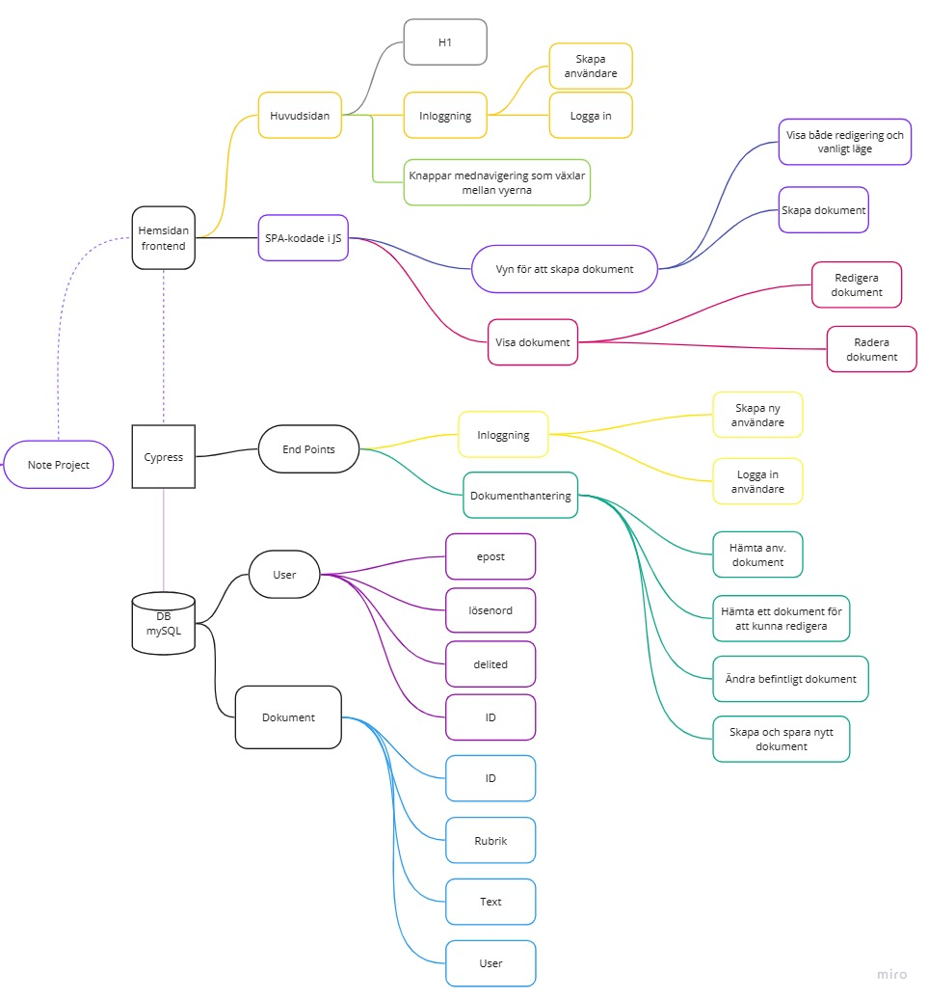

Uppgiften Notes

Vi bygger ett dokumenthanteringssystem med en relationsdatabas!

Bakgrund

Du har fått en kund som vill bygga ett eget system för att skapa digitala dokument och önskar att se en demo på detta.
Kunden vill kunna logga in på sitt system, där se en lista på alla skapade dokument, kunna skapa nya och redigera de som redan finns där. När kunden tittar på ett skapat dokument så skall det finnas möjlighet att se dokumentet både “live” dvs utan redigeringsläget samt att se dokumentet i redigeringsläge.

Tekniska krav

Det skall finnas en inloggning, men nivån på säkerhet för prototyp bestämmer du själv (dokumentera hur du har valt att göra).

Dokument skall skapas och sparas i en MySql databas.
Projektet skall utformas som en headless applikation, dvs med ett frontend projekt och ett API.

För dokument skall det finnas en WYSIWYG redigering. 

Ett dokument skall kunna visas i både redigerings och “vanligt” läge.

Förutom dessa tekniska krav är resten utav arkitekturen upp till dig. 

VG Krav

Det skall i WYSIWYG editorn gå att ändra både textfärg och bakgrundsfärg i editorn, samt att det skall gå att spara. 
Du skall även lämna in en reflekterande text över hur du har arbetat med ditt projekt. Vilka beslut har du tagit, vilka problem har du fastnat i och hur har du valt att lösa dessa. Max 2 A4.
Du behöver inte beskriva så mycket “hur” du har löst uppgiften, det ser vi när vi tittar på ditt repo, utan du ska beskrva ditt “varför”.

My Projectplan

******************************************************************************************

Kvar att göra: 
Spara första gången: 
* Visa dok
* Spara i DB 
    * Spara om note ej finnes med det namnet för den användaren - skicka tillbaka ID
    ** Töm fältet
    * Felmeddelande att namnet redan finns. 
Uppdatera en note: 
* Spara endast över rådatan. 
* Spara om titeln om ej finnes hos anvId.
* Sparas på samma noteId som är hämtad ifrån.

Bara en mail ska kunna registreras en gång.

Kolla över designen på inloggningen.

Testas för buggar. 

*******************************************************************************************